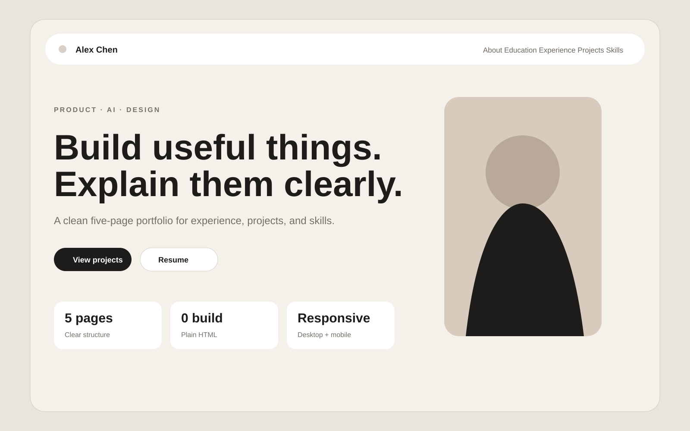
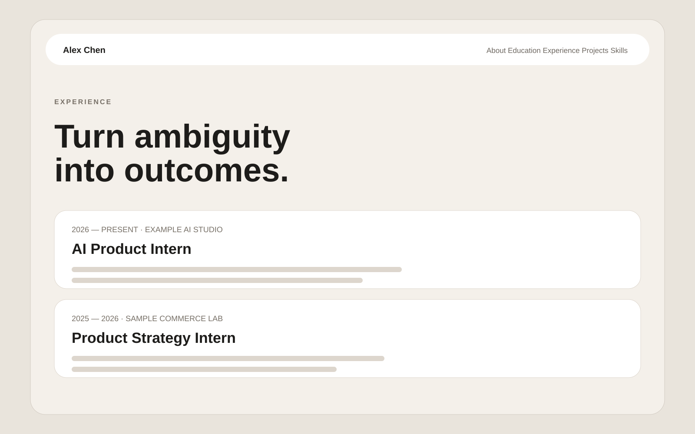

<div align="center">

# Resume Portfolio Template

**一个开箱即用、零构建依赖、隐私友好的个人简历 / Portfolio 网站模板。**  
适合产品经理、设计师、开发者、学生和求职者，用清晰的 5 页结构展示经历、项目与能力。


**5 pages · responsive · no framework · easy to customize · GitHub Pages ready**

</div>

---

## 👀 Preview

<p align="center">
  
</p>

> 首页用一句话定位 + 关键入口快速建立印象；详细内容拆到独立页面，避免把所有信息挤进一张超长在线简历。

<p align="center">
  
</p>

### 项目视觉示例

<table>
<tr>
<td width="50%" valign="top">

<br /><b>Project Overview</b><br />适合产品 Demo、项目概览、研究成果与信息聚合产品。
</td>
<td width="50%" valign="top">

<br /><b>Dashboard / Evaluation</b><br />适合数据看板、评测平台、实验结果与质量分析。
</td>
</tr>
</table>

> 仓库中的姓名、学校、公司、指标、邮箱、简历内容和项目图片均为**虚构 / 合成示例**，不包含原个人网站的真实个人信息或内部业务资产。

---

## ✨ 为什么做这个模板？

很多简历网站有两个极端：要么只是把 PDF 搬到网页上，要么需要 React / Next.js / Node.js 才能改几个字。这个模板希望保持作品集的表达力，同时降低使用门槛。

- **5 页信息架构**：About → Education → Experience → Projects → Skills
- **零构建依赖**：只有 HTML / CSS / JavaScript
- **响应式布局**：桌面与移动端都能阅读
- **项目视觉优先**：内置作品图、流程图、Dashboard 示例
- **简历预览**：自带合成 Resume 示例，可替换为自己的公开版
- **结果导向写法**：适合用「问题 → 动作 → 结果」讲项目
- **隐私优先**：这是从干净目录建立的开源模板，不继承私人站点 Git 历史
- **静态部署友好**：GitHub Pages / Cloudflare Pages / Vercel / Netlify / CloudBase 均可使用

---

## 🚀 30 秒启动

### 方式 1：直接打开

下载仓库后直接打开：

```text
index.html
```

### 方式 2：本地静态服务器（推荐）

```bash
python3 -m http.server 8000
```

然后访问：

```text
http://localhost:8000
```

这个项目**不需要**：

```text
npm install
npm run build
```

---

## 🗂️ 页面结构

| 页面 | 文件 | 适合展示 |
| --- | --- | --- |
| About | `index.html` | 一句话定位、简介、CTA、核心特点 |
| Education | `education.html` | 学校、专业、课程、荣誉、研究方向 |
| Experience | `experience.html` | 公司、岗位、项目、可公开结果 |
| Projects | `projects.html` | Side Project、Demo、Workflow、研究项目 |
| Skills | `skills.html` | 能力矩阵、工具、联系方式 |

```text
.
├── index.html
├── education.html
├── experience.html
├── projects.html
├── skills.html
├── styles.css
├── script.js
├── assets/
│   ├── hero-portrait.svg
│   ├── project-overview.svg
│   ├── product-flow.svg
│   ├── evaluation-dashboard.svg
│   ├── resume-page-1.svg
│   └── resume-page-2.svg
├── docs/
│   ├── preview-home.svg
│   └── preview-experience.svg
├── PRIVACY.md
└── LICENSE
```

---

## 🛠️ 怎么改成你自己的？

### 1. 替换基础信息

全局搜索这些示例内容：

```text
Alex Chen
Example University
Example AI Studio
hello@example.com
https://github.com/yourname
```

替换成你**确定愿意公开**的信息。

### 2. 重写经历

比起职责罗列，更推荐：

```text
背景 / 问题
↓
你采取了什么动作
↓
为什么这样做
↓
最终产生什么结果
```

产品、策略、运营、数据岗位尤其适合写成：

```text
场景 + 问题 → 策略 / 产品动作 → 实验 / 数据结果
```

### 3. 替换项目图片

`assets/` 中的图片全部是合成占位图，可以直接换成你的公开项目素材：

```html

```

推荐优先展示：

- 产品流程 / Architecture
- Demo 截图
- Dashboard
- Before / After
- 用户旅程
- 评测框架
- 原型与关键交互

### 4. 替换简历预览

示例简历：

```text
assets/resume-page-1.svg
assets/resume-page-2.svg
```

可以替换成自己的公开安全版本。**不要直接把私人简历 PDF、手机号、家庭地址或不希望被搜索引擎收录的信息上传到公开仓库。**

### 5. 修改视觉风格

主要样式集中在 `styles.css`，可以快速调整：

- 页面背景与主题色
- 字体层级
- 卡片圆角
- Header / Navigation
- 项目图片比例
- 移动端布局

---

## 🔒 Privacy First

个人网站通常比普通代码仓库更容易意外泄露信息，例如：

- 旧手机号 / 私人邮箱
- 真实简历和作品集 ZIP
- 个人照片原文件
- 公司内部后台截图
- 未公开业务数据
- 工号、账号、IM 联系方式
- `.env` / Token / API Key
- 已删除但仍存在于 Git 历史中的敏感文件

因此这个开源版本采用的是**重新建立干净模板仓库**，而不是把原私人项目直接切成 Public。

更完整的检查清单见 [`PRIVACY.md`](PRIVACY.md)。

发布自己的版本前建议执行：

```bash
git grep -nEi 'phone|email|token|secret|api[_-]?key|password|private'
git log --all --stat
```

---

## 🌐 部署到 GitHub Pages

1. Fork / Clone 仓库
2. 修改自己的内容
3. 打开仓库 **Settings → Pages**
4. `Source` 选择 **Deploy from a branch**
5. Branch 选择 `main`
6. Folder 选择 `/ (root)`
7. 保存

不需要 Build Command。

同样可以部署到 Cloudflare Pages、Vercel、Netlify、CloudBase 或任意静态服务器。

---

## 💡 让 Portfolio 更值得看

真正让个人网站有辨识度的，通常不是多加几个动画，而是：

1. **首页一句话定位**：5 秒内让人知道你是谁、想做什么
2. **3–4 个重点项目**：少而精，比堆项目更有效
3. **视觉证据**：流程图、Demo、看板、前后对比比纯文字更容易理解
4. **可公开结果**：有数据时尽量展示有意义的结果
5. **个人表达**：不要把整个网站写成复制粘贴的简历腔

---

## ❓ FAQ

**需要会前端吗？**  
不需要。会修改 HTML 文字、替换图片路径就能完成大部分定制。

**可以只保留 2–3 页吗？**  
可以。删除不需要的 HTML 文件，同时删除导航链接即可。

**可以改成英文版吗？**  
可以，模板没有语言依赖。

**可以商用吗？**  
可以，遵循 MIT License。

**为什么不用原私人网站直接开源？**  
因为公开仓库不仅会暴露当前文件，还可能暴露 Git 历史。对个人网站来说，建立新的 sanitized repository 通常更安全。

---

## ⭐ If this helps

如果它能帮你更快搭好自己的求职主页 / Portfolio，欢迎 **Star / Fork**。

也欢迎提交 Issue / PR：

- 新页面样式
- 更多岗位示例
- Mobile / Accessibility 优化
- 新的部署方式
- 更好的作品集展示组件

---

## License

[MIT License](LICENSE) — 可自由使用、修改和分发。
