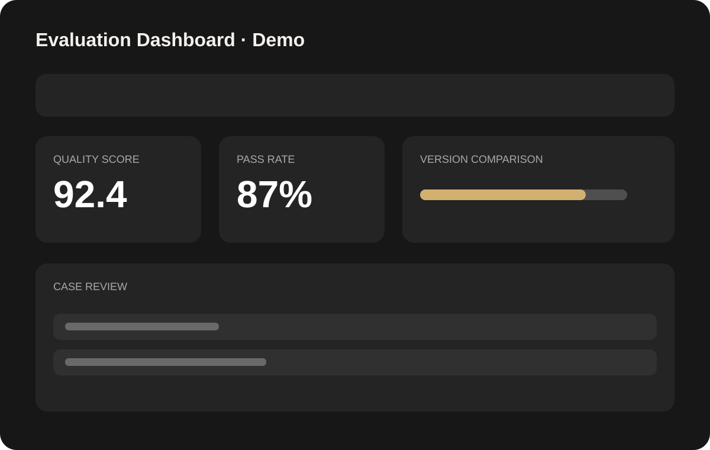

<div align="center">

# Resume Portfolio Template

**一个开箱即用、零构建依赖、隐私友好的个人简历 / Portfolio 网站模板。**  
适合产品经理、设计师、开发者、学生和求职者，用 5 个清晰页面展示自己，而不是把所有内容挤进一张长图。


**5 pages · responsive · no framework · easy to customize · GitHub Pages ready**

</div>

---

## 👀 Preview

<p align="center">
  
</p>

> 首页强调一句话定位、能力标签和核心入口。详细经历拆到独立页面，让访问者可以快速浏览，也可以继续深入阅读。

<p align="center">
  
</p>

### 项目图片也预留了完整展示样式

<table>
<tr>
<td width="50%" valign="top">

<br /><b>Project Overview</b><br />适合产品 Demo、项目概览、研究成果等大图展示。
</td>
<td width="50%" valign="top">

<br /><b>Dashboard / Evaluation</b><br />适合数据看板、评测平台、实验结果等作品集内容。
</td>
</tr>
</table>

> 上述姓名、学校、公司、指标、邮箱、简历和项目图片均为**虚构 / 合成示例**，不是原作者真实个人信息。

---

## ✨ Why this template?

很多个人简历网站要么只是一张“在线简历”，要么需要 React / Next.js / Node.js 才能启动。这个模板更适合希望**快速上线，又保留作品集表达能力**的人：

- **5 页信息架构**：关于我 → 教育背景 → 实习经历 → 项目经历 → 技能与其他
- **零构建依赖**：只有 HTML / CSS / JavaScript，下载后就能运行
- **响应式布局**：桌面和移动端都可以阅读
- **连续阅读体验**：滚动到页底继续下滑，可自然进入下一页
- **联系弹窗**：内置两页示例简历 Carousel，可替换成自己的公开版简历
- **图片 Lightbox**：点击项目图即可放大查看，更适合作品集展示
- **统一叙事模板**：项目天然适合用「背景 / 问题 → 动作 → 结果」表达
- **隐私优先**：开源版本从干净目录重建，不携带原个人网站中的真实资产
- **静态部署友好**：GitHub Pages / Cloudflare Pages / Vercel / Netlify / CloudBase 都能托管

---

## 🚀 30 秒启动

### 方法 1：直接打开

下载仓库后，双击：

```text
index.html
```

即可预览。

### 方法 2：启动本地静态服务器（推荐）

```bash
python3 -m http.server 8000
```

浏览器访问：

```text
http://localhost:8000
```

不需要：

```text
npm install
npm run build
```

因为这个项目**没有 Node.js 依赖，也没有构建步骤**。

---

## 🗂️ 页面结构

| 页面 | 文件 | 推荐放什么 |
| --- | --- | --- |
| 关于我 | `index.html` | 一句话定位、简介、核心能力、CTA |
| 教育背景 | `education.html` | 学校、专业、课程、荣誉、研究方向 |
| 实习经历 | `experience.html` | 公司、岗位、项目、业务结果 |
| 项目经历 | `projects.html` | Side Project、Demo、Workflow、研究项目 |
| 技能与其他 | `skills.html` | 能力矩阵、工具、语言、联系方式 |

### 文件结构

```text
.
├── index.html
├── education.html
├── experience.html
├── projects.html
├── skills.html
├── styles.css
├── script.js
│
├── assets/
│   ├── avatar.svg
│   ├── hero-portrait.svg
│   ├── project-overview.svg
│   ├── product-flow.svg
│   ├── evaluation-dashboard.svg
│   ├── resume-page-1.svg
│   └── resume-page-2.svg
│
├── docs/
│   ├── preview-home.png
│   └── preview-experience.png
│
├── ARCHITECTURE.md
├── PRIVACY.md
└── LICENSE
```

---

## 🛠️ Customize it

这个模板没有复杂配置文件。大部分修改直接在对应 HTML 里完成。

### 1. 替换基础信息

全局搜索这些示例内容：

```text
Alex Chen
Example University
hello@example.com
https://github.com/yourname
```

替换成你**愿意公开**的信息即可。

### 2. 写教育 / 实习经历

推荐不要写成岗位职责清单，而是尽量保持下面的结构：

```text
背景 / 问题
↓
你做了什么
↓
为什么这样做
↓
最后产生了什么结果
```

对于产品、运营、策略和数据岗位，可以尽量写成：

```text
场景 + 问题 → 策略 / 产品动作 → 实验 / 数据结果
```

### 3. 替换项目图片

`assets/` 当前全部是合成占位资源，可以直接替换成自己的公开项目图。

例如：

```html

```

项目图片支持点击放大，无需额外接入图片预览库。

### 4. 替换简历预览

联系弹窗中的两页简历来自：

```text
assets/resume-page-1.svg
assets/resume-page-2.svg
```

你可以换成自己的公开版本，但建议先做一次隐私检查。

### 5. 改主题风格

主要视觉变量都集中在 `styles.css`。你可以修改：

- 页面背景
- 字号和间距
- 卡片圆角
- Header / Navigation
- 项目图片比例
- 移动端断点

不需要改 JS 才能完成基本换肤。

---

## 🔒 Privacy first

这个仓库特意采用了**“新建干净开源副本”**的方式，而不是把原个人网站仓库直接改成 Public。

原因很简单：即使你删除了当前版本里的手机号或私人文件，Git 历史中仍可能保存：

- 旧手机号 / 私人邮箱
- 真实简历 PDF
- 个人照片
- 公司内部页面截图
- 未公开业务数据
- `.env` / Token / API Key
- 曾经删除过但仍存在于 Git history 的文件

### 不建议直接上传的内容

- 公司内部后台、实验平台、数据看板截图
- 未公开业务指标 / 策略文档
- 工号、微信、手机号、私人邮箱
- 带真实地址或身份证明的信息
- 私人简历 PDF / 完整作品集 ZIP（除非你明确想公开）
- `.env`、Token、API Key、Access Key、Secret

仓库附带更完整的 [`PRIVACY.md`](PRIVACY.md)。

发布前建议执行：

```bash
git grep -nEi 'phone|email|token|secret|api[_-]?key|password|private'
git log --all --stat
```

> 如果你的旧仓库曾经出现敏感信息，最安全的方法通常不是“删掉以后再公开”，而是重新建立一个只包含公开内容的干净仓库。

---

## 🌐 Deploy

### GitHub Pages

1. 将项目推送到 GitHub
2. 打开仓库 **Settings → Pages**
3. `Source` 选择 **Deploy from a branch**
4. Branch 选择 `main`
5. Folder 选择 `/ (root)`
6. 保存

这个项目不需要 Build Command。

### 其他静态托管

也可以直接部署到：

- Cloudflare Pages
- Vercel
- Netlify
- 腾讯云 CloudBase
- 任意 Nginx / OSS 静态服务器

部署目录就是项目根目录。

---

## 💡 Make it yours

想让这个模板更有“个人感”，最有效的不是加更多动画，而是替换这几件东西：

1. **首页一句话定位**：让人 5 秒知道你是谁、在做什么
2. **3–4 个真正重要的项目**：少而精，比堆 10 个项目有效
3. **项目视觉**：流程图、Demo、看板、前后对比，比纯文字更容易理解
4. **结果数据**：能公开的情况下，优先展示真实结果
5. **个人语气**：保留简洁专业，但不要把所有文字写成标准简历腔

---

## ❓ FAQ

**Q：一定要会前端吗？**  
不需要。会编辑 HTML 文字、替换图片路径，就可以完成大部分自定义。

**Q：可以只保留一两个页面吗？**  
可以。删除不需要的 HTML 页面，并同步删掉导航里的链接即可。

**Q：可以改成英文简历网站吗？**  
可以。模板本身没有语言依赖，直接替换页面文字即可。

**Q：可以商用吗？**  
可以，遵循 MIT License。

**Q：为什么不直接开源原个人网站？**  
因为个人网站往往包含历史简历、照片、业务截图和旧联系方式。这个项目选择从干净目录重建，减少 Git 历史带来的隐私风险。

---

## ⭐ If this helps

如果这个模板对你的求职主页、个人 Portfolio 或作品集搭建有帮助，可以 **Star / Fork** 后改成自己的版本。

也欢迎提交 Issue / PR 来补充：

- 新的页面样式
- 更多行业示例
- 更好的移动端细节
- Accessibility 优化
- 新的部署方案

---

## License

[MIT License](LICENSE) — 可自由使用、修改和分发。
